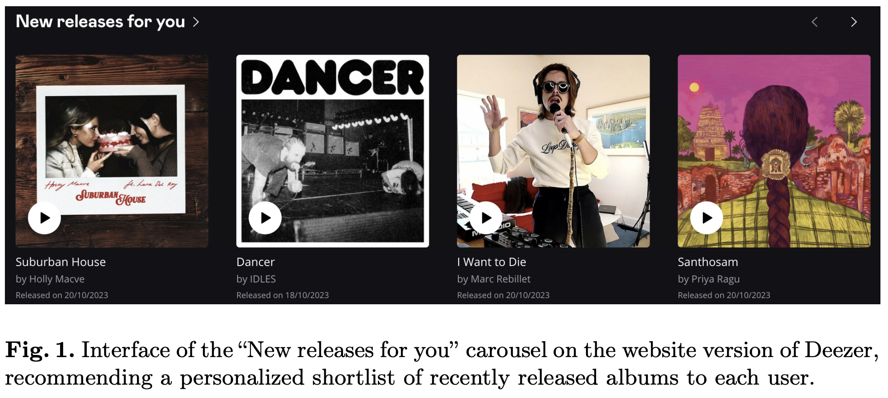

# Let's Get It Started: Fostering the Discoverability of New Releases on Deezer

This repository will contain resources related to the paper: _"Let’s Get It Started: Fostering the Discoverability of New Releases on Deezer"_ by Léa Briand, Théo Bontempelli, Walid Bendada, Mathieu Morlon, François Rigaud, Benjamin Chapus, Thomas Bouabça, and Guillaume Salha-Galvan.

This work has been accepted for presentation as an "Industry Talk" at the 46th European Conference on Information Retrieval  ([ECIR 2024](https://www.ecir2024.org/)) in Glasgow.

<br>
<p align="center">
  
</p>


## Summary 

Music artists release hundreds of thousands of new albums every week on the music streaming service [Deezer](https://www.deezer.com/fr/).
The prompt integration of this content, along with its swift discoverability through recommender systems and search engines, holds significant importance. For Deezer, it ensures that users have immediate access to the latest music of their favorite artists while also easily coming upon new ones they might like, which is known to improve the user experience. The proper exposure of new releases also benefits artists by amplifying their visibility, which
can contribute to their success, boost their revenues, and foster the emergence
of new talents. Nonetheless, displaying the right releases to the right users remains challenging due to the limited prior information on this fresh content, especially for new artists unknown from the service.

In this paper, we present our recent efforts to better showcase new releases on Deezer, both in terms of recommendation performance and number of new releases exposed to users. Specifically, we first focus on the product context. We describe in Section 2 our search and recommendation features dedicated to new releases, along with their objectives and differences. We also dive into our historical semi-personalized solution for new release recommendation, based on editorial pre-selections, and its limitations in terms of catalog coverage and adaptability. Then, in Section 3, we detail the fully personalized systems we deployed in 2023 to overcome these limitations, involving a cold start neural embedding model along with contextual bandits. We provide an online evaluation of our approach on Deezer's _"New releases for you"_ carousel of recommended new albums. Finally, we conclude in Section 4 by discussing our ongoing efforts to improve our models and how we present new releases on the Deezer homepage.

<br>
<p align="center">
  
</p>


## Paper

_Soon._

## Slides

_Soon._

## Video

_Soon._

## Citation

```BibTeX
@inproceedings{briand2024fostering,
  title={Let's Get It Started: Fostering the Discoverability of New Releases on Deezer},
  author={Briand, L{\'e}a and Bontempelli, Th{\'e}o and Bendada, Walid and Morlon, Mathieu and Rigaud, Fran{\c{c}}ois and Chapus, Benjamin and Bouab{\c{c}}a, Thomas and Salha-Galvan, Guillaume}
  booktitle={Proceedings of the 46th European Conference on Information Retrieval},
  year={2024}
}
```

